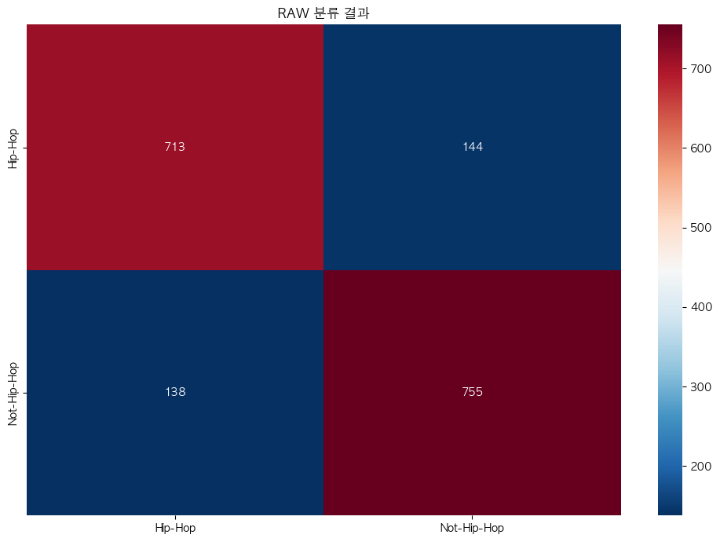

# "이것은 국힙위상이 왜 이렇게 떨어졌는가." 시작된 프로젝트

## tl;dr

Theme : 국힙위상은 왜 이렇게 떨어졌나?

Reason

- **음악시장의 파이 자체가 코로나 이후 상당히 줄어 들었다.**
  - 근거 : 한국콘텐츠진흥원 2019 ~ 2023 음악이용자실태조사
  - 이유(추측) : 이제 우리는 음악말고 다른 것들을 더 많이 듣기 시작했다.
    - (ex. 슈카월드 / 국힙해설유튜브)

- 힙합이 **과거에 유행에서 쇠퇴한 장르**의 성향을 닮아가고 있다.
  - 설명 : 재즈 / 락 과 같은 장르도 유행에서 Expermental한 요소가 Main Stream으로 올라오며 대중에게서 멀어졌다.
  - 근거 : 2017 한국힙합어워즈 앨범부터 2024 한국힙합어워즈 앨범까지의 음악을 `fma`데이터로 fit한 장르 분석기 기반의 해석
  - [국내힙합의 장르변화](#국힙의-시간에-따른-장르-변화)

## 한 것

### 1. 음악 이용자 실태조사 데이터를 분석

- Data :
  - 한국콘텐츠진흥원
  - 2019 ~ 2023 음악 이용자 실태 조사

- 결론
  - 국힙의 위상이 떨어진 것은 사실
  - 음악 시장 자체의 파이가 상당히 줄어들었다.

- Why :
  - 영상매체를 사운드로 소비하는 문화

### 2. 국내힙합의 장르 변화

- Data:
  - fma
    - 음악 데이터 45000개 정도
    - chroma related ~ mfcc ~ spectral ~ tonnetz ~ zcr
  - 국힙 데이터
    - 힙합어워드 수상작 중 개인적인 선택
    - 2018 ~ 2024 음악 작품 mp3

- 분석 1차
  - PCA / Clustering
    - 시각화
    - 장르의 유사성 판단

#### 장르간 유사성

- 분석 2차
  - 5개 장르로 음악 구분
    - acc : .68
        
  - 3개 장르(hiphop / experimental / etcs) 음악 구분
    - acc : .73
    - 이것의 이유는 experiemental화 되는 음악 장르는 점점 대중에서 멀어진다는 적절한 근거를 제시한 영상을 봄
        

  - 2개 장르(hiphop / not-hiphop) 음악 구분
    - acc : .83
        

#### 국힙의 시간에 따른 장르 변화

---

## Inspired by

- [fma : mp3에서 feature를 추출하는 방법](https://github.com/mdeff/fma)
- [librosa : python에서 가장 유명한 소리데이터를 다루는 라이브러리?](https://github.com/librosa/librosa)
- [유튜브 : 장르에 experimental 열풍이 불기 시작하면 점점 쇠퇴한다?](https://www.youtube.com/watch?v=Ua6hkhTZb7E)
